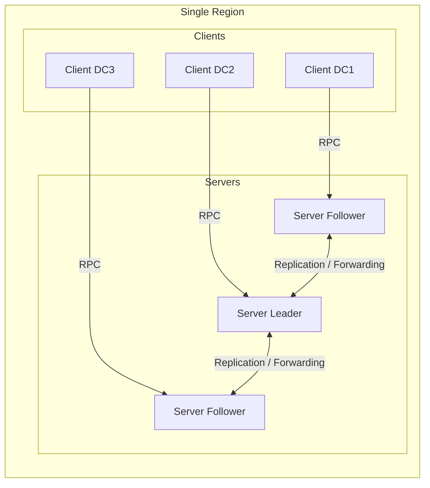
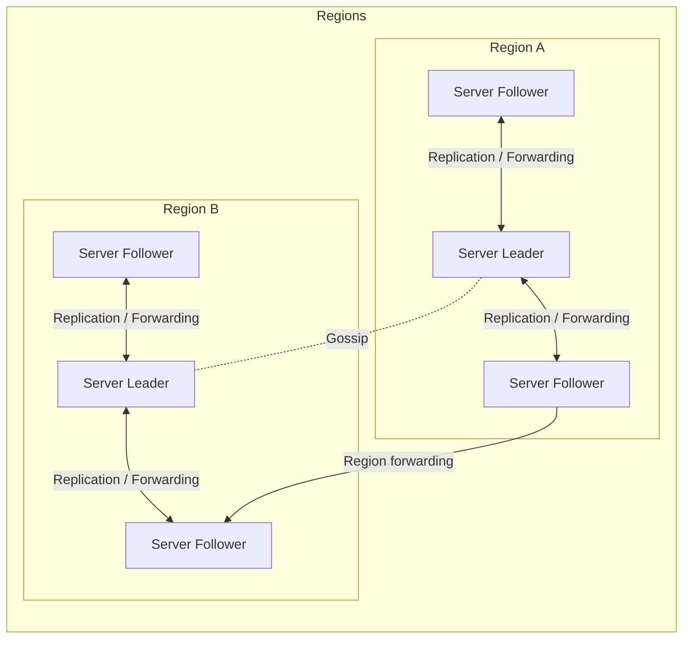

# Architecture

OpenWonton is a complex system that has many different pieces. To help both users and developers of OpenWonton
build a mental model of how it works, this page documents the system architecture.

Refer to the [glossary][] for more details on some of the terms discussed here.

~> **Advanced Topic!** This page covers technical details
of OpenWonton. You do not need to understand these details to
effectively use OpenWonton. The details are documented here for
those who wish to learn about them without having to go
spelunking through the source code.

## High-Level Overview

Looking at only a single region, at a high level OpenWonton looks like this:

Mermaid diagram:

Within each region, we have both clients and servers. Servers are responsible for
accepting jobs from users, managing clients, and [computing task placements](/nomad/docs/concepts/scheduling/scheduling).
Each region may have clients from multiple datacenters, allowing a small number of servers
to handle very large clusters.

In some cases, for either availability or scalability, you may need to run multiple
regions. OpenWonton supports federating multiple regions together into a single cluster.
At a high level, this setup looks like this:

Mermaid diagram:

Regions are fully independent from each other, and do not share jobs, clients, or
state. They are loosely-coupled using a gossip protocol, which allows users to
submit jobs to any region or query the state of any region transparently. Requests
are forwarded to the appropriate server to be processed and the results returned.
Data is _not_ replicated between regions.

The servers in each region are all part of a single consensus group. This means
that they work together to elect a single leader which has extra duties. The leader
is responsible for processing all queries and transactions. OpenWonton is optimistically
concurrent, meaning all servers participate in making scheduling decisions in parallel.
The leader provides the additional coordination necessary to do this safely and
to ensure clients are not oversubscribed.

Each region is expected to have either three or five servers. This strikes a balance
between availability in the case of failure and performance, as consensus gets
progressively slower as more servers are added. However, there is no limit to the number
of clients per region.

Clients are configured to communicate with their regional servers and communicate
using remote procedure calls (RPC) to register themselves, send heartbeats for liveness,
wait for new allocations, and update the status of allocations. A client registers
with the servers to provide the resources available, attributes, and installed drivers.
Servers use this information for scheduling decisions and create allocations to assign
work to clients.

Users make use of the OpenWonton CLI or API to submit jobs to the servers. A job represents
a desired state and provides the set of tasks that should be run. The servers are
responsible for scheduling the tasks, which is done by finding an optimal placement for
each task such that resource utilization is maximized while satisfying all constraints
specified by the job. Resource utilization is maximized by bin packing, in which
the scheduling tries to make use of all the resources of a machine without
exhausting any dimension. Job constraints can be used to ensure an application is
running in an appropriate environment. Constraints can be technical requirements based
on hardware features such as architecture and availability of GPUs, or software features
like operating system and kernel version, or they can be business constraints like
ensuring PCI compliant workloads run on appropriate servers.

## Getting in Depth

This has been a brief high-level overview of the architecture of OpenWonton. There
are more details available for each of the sub-systems. The [consensus protocol](/nomad/docs/concepts/consensus),
[gossip protocol](/nomad/docs/concepts/gossip), and [scheduler design](/nomad/docs/concepts/scheduling/scheduling)
are all documented in more detail.

For other details, either consult the code, [open an issue on
GitHub][gh_issue], or ask a question in the [community forum][forum].

[gh_issue]: https://github.com/openwonton/openwonton/issues/new/choose
[forum]: https://discuss.hashicorp.com/c/nomad
[glossary]: /nomad/docs/glossary
