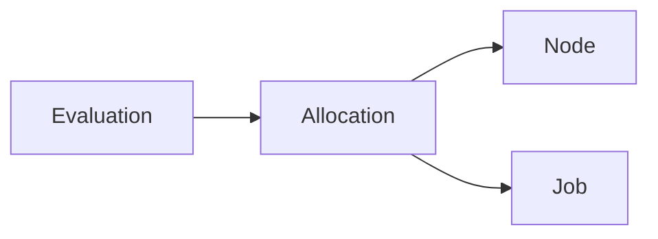

# Scheduling in OpenWonton

Mermaid diagram:

There are four primary "nouns" in OpenWonton; jobs, nodes, allocations, and
evaluations. Jobs are submitted by users and represent a _desired state_. A job
is a declarative description of tasks to run which are bounded by constraints
and require resources. Tasks can be scheduled on nodes in the cluster running
the OpenWonton client. The mapping of tasks in a job to clients is done using
allocations. An allocation is used to declare that a set of tasks in a job
should be run on a particular node. Scheduling is the process of determining
the appropriate allocations and is done as part of an evaluation.

An evaluation is created any time the external state, either desired or
emergent, changes. The desired state is based on jobs, meaning the desired
state changes if a new job is submitted, an existing job is updated, or a job
is deregistered. The emergent state is based on the client nodes, and so we
must handle the failure of any clients in the system. These events trigger the
creation of a new evaluation, as OpenWonton must _evaluate_ the state of the world
and reconcile it with the desired state.

This diagram shows the flow of an evaluation through OpenWonton:

Mermaid diagram:

```mermaid
flowchart TB
  classDef event stroke-dasharray:5 3,fill:#0d1722,stroke:#f6a23a
  classDef core fill:#121a24,stroke:#f6a23a
  classDef alloc fill:#16212d,stroke:#f6a23a

  subgraph Events["Events"]
    direction LR
    JR["Job register"]:::event -->|Create| EV1["Evaluation"]
    JU["Job update"]:::event -->|Create| EV2["Evaluation"]
    NF["Node failure"]:::event -->|Create| EV3["Evaluation"]
  end

  EV1 -->|Enqueue| Broker["Evaluation Broker<br/>(Leader)"]:::core
  EV2 -->|Enqueue| Broker
  EV3 -->|Enqueue| Broker

  Broker -->|Dequeue| Svc["Server<br/>Service scheduler"]:::core
  Broker -->|Dequeue| Batch["Server<br/>Batch scheduler"]:::core
  Broker -->|Dequeue| Custom["Server<br/>Custom scheduler"]:::core

  Svc -->|Submit plan| PlanQ["Plan Queue<br/>(Leader)"]:::core
  Batch -->|Submit plan| PlanQ
  Custom -->|Submit plan| PlanQ

  PlanQ -->|Plan result| Svc
  PlanQ -->|Plan result| Batch
  PlanQ -->|Plan result| Custom

  PlanQ -->|Create| A1["Allocation"]:::alloc
  PlanQ -->|Create| A2["Allocation"]:::alloc
  PlanQ -->|Create| A3["Allocation"]:::alloc
```

The lifecycle of an evaluation begins with an event causing the evaluation to
be created. Evaluations are created in the `pending` state and are enqueued
into the evaluation broker. There is a single evaluation broker which runs on
the leader server. The evaluation broker is used to manage the queue of pending
evaluations, provide priority ordering, and ensure at least once delivery.

OpenWonton servers run scheduling workers, defaulting to one per CPU core, which are
used to process evaluations. The workers dequeue evaluations from the broker,
and then invoke the appropriate scheduler as specified by the job. OpenWonton ships
with a `service` scheduler that optimizes for long-lived services, a `batch`
scheduler that is used for fast placement of batch jobs, `system` and
`sysbatch` schedulers that are used to run jobs on every node, and a `core`
scheduler which is used for internal maintenance.

Schedulers are responsible for processing an evaluation and generating an
allocation _plan_. The plan is the set of allocations to evict, update, or
create. The specific logic used to generate a plan may vary by scheduler, but
generally the scheduler needs to first reconcile the desired state with the
real state to determine what must be done. New allocations need to be placed
and existing allocations may need to be updated, migrated, or stopped.

Placing allocations is split into two distinct phases, feasibility checking and
ranking. In the first phase the scheduler finds nodes that are feasible by
filtering nodes in datacenters and node pools not used by the job, unhealthy
nodes, those missing necessary drivers, and those failing the specified
constraints.

The second phase is ranking, where the scheduler scores feasible nodes to find
the best fit. Scoring is primarily based on bin packing, which is used to
optimize the resource utilization and density of applications, but is also
augmented by affinity and anti-affinity rules. OpenWonton automatically applies a job
anti-affinity rule which discourages colocating multiple instances of a task
group. The combination of this anti-affinity and bin packing optimizes for
density while reducing the probability of correlated failures.

Once the scheduler has ranked enough nodes, the highest ranking node is
selected and added to the allocation plan.

When planning is complete, the scheduler submits the plan to the leader which
adds the plan to the plan queue. The plan queue manages pending plans, provides
priority ordering, and allows OpenWonton to handle concurrency races. Multiple
schedulers are running in parallel without locking or reservations, making
OpenWonton optimistically concurrent. As a result, schedulers might overlap work on
the same node and cause resource over-subscription. The plan queue allows the
leader node to protect against this and do partial or complete rejections of a
plan.

As the leader processes plans, it creates allocations when there is no conflict
and otherwise informs the scheduler of a failure in the plan result. The plan
result provides feedback to the scheduler, allowing it to terminate or explore
alternate plans if the previous plan was partially or completely rejected.

Once the scheduler has finished processing an evaluation, it updates the status
of the evaluation and acknowledges delivery with the evaluation broker. This
completes the lifecycle of an evaluation. Allocations that were created,
modified or deleted as a result will be picked up by client nodes and will
begin execution.

[omega]: https://research.google.com/pubs/pub41684.html
[borg]: https://research.google.com/pubs/pub43438.html
