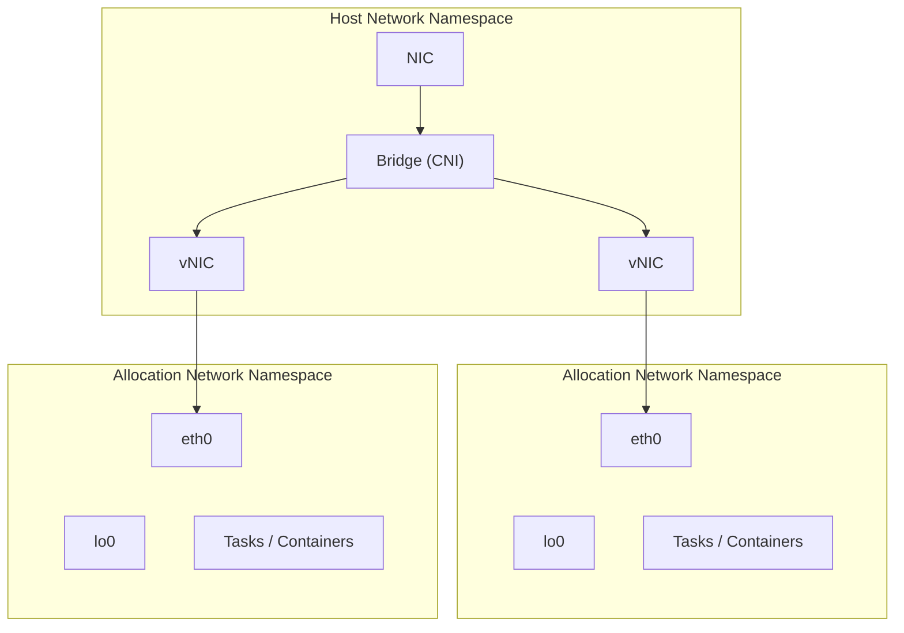

# Container Network Interface (CNI)

OpenWonton has built-in support for scheduling compute resources such as
CPU, memory, and networking. OpenWonton's network plugin support extends
this to allow scheduling tasks with purpose-created or specialty network
configurations. Network plugins are third-party plugins that conform to the
[Container Network Interface (CNI)][cni_spec] specification.

Network plugins need to be installed and configured on each client. The [OpenWonton
installation instructions][nomad_install] recommend installing the [CNI
reference plugins][cni_ref] because certain OpenWonton networking features, like
`bridge` network mode and Consul service mesh, leverage them to provide an
operating-system agnostic interface to configure workload networking.

Custom networking in OpenWonton is accomplished with a combination of CNI plugin
binaries and CNI configuration files.

## CNI reference plugins

The CNCF maintains a set of reference CNI plugins for basic network operations.
These plugins are required for OpenWonton's `bridge` networking mode and for integrating
with Consul service mesh.

See the Linux [post-install steps][cni_install] for installing CNI reference plugins.

## CNI plugins

Spec-compliant plugins should work with OpenWonton, however, it's possible a plugin
vendor has implemented their plugin to make non-standard API calls, or it is
otherwise non-compliant with the CNI specification. In those situations the
plugin may not function correctly in a OpenWonton environment. You should verify
plugin compatibility with OpenWonton before deploying in production.

CNI plugins are installed and configured on a per-client basis. OpenWonton consults
the path given in the client's [`cni_path`][] to find CNI plugin executables.

## CNI configuration files

The CNI specification defines a network configuration format for administrators.
It contains directives for both the orchestrator and the plugins to consume.
At plugin execution time, this configuration format is interpreted by OpenWonton
and transformed into arguments for the plugins.

OpenWonton reads the following extensions from the [`cni_config_dir`][]—
`/opt/cni/config` by default:

* `.conflist` files are loaded as [network
  configurations][cni_spec_net_config] that contain a list of plugin
  configurations.

* `.conf` and `.json` files are loaded as individual [plugin
  configurations][cni_spec_plugin_config] for a specific network.

## Using CNI networks with OpenWonton jobs

To specify that a job should use a CNI network, set the task group's
network [`mode`][] attribute to the value `cni/<your_cni_config_name>`.
OpenWonton will then schedule the workload on client nodes that have fingerprinted a
CNI configuration with the given name. For example, to use the configuration
named `mynet`, you should set the task group's network mode to `cni/mynet`.
Nodes that have a network configuration defining a network named `mynet` in
their [`cni_config_dir`][] will be eligible to run the workload.

## OpenWonton's `bridge` configuration

OpenWonton itself uses CNI plugins and configuration as the underlying implementation
for the `bridge` network mode, using the [loopback][], [bridge][], [firewall][],
and [portmap][] CNI plugins configured together to create OpenWonton's bridge
network.

The following is the configuration template OpenWonton uses when setting up these
networks with the template placeholders replaced with the default configuration
values for [`bridge_network_name`][], [`bridge_network_subnet`][], and an
internal constant that provides the value for `iptablesAdminChainName`. This is
a convenient jumping off point to discuss a worked example.

```json
{
  "cniVersion": "0.4.0",
  "name": "nomad",
  "plugins": [
    {
      "type": "loopback"
    },
    {
      "type": "bridge",
      "bridge": "nomad",
      "ipMasq": true,
      "isGateway": true,
      "forceAddress": true,
      "hairpinMode": false,
      "ipam": {
        "type": "host-local",
        "ranges": [
          [
            {
              "subnet": "172.26.64.0/20"
            }
          ]
        ],
        "routes": [
          { "dst": "0.0.0.0/0" }
        ]
      }
    },
    {
      "type": "firewall",
      "backend": "iptables",
      "iptablesAdminChainName": "NOMAD-ADMIN"
    },
    {
      "type": "portmap",
      "capabilities": {"portMappings": true},
      "snat": true
    }
  ]
}
```

Mermaid diagram:



For a more thorough understanding of this configuration, consider each CNI
plugin's configuration in turn.

### loopback

The `loopback` plugin sets the default local interface, `lo0`, created inside
the bridge network's network namespace to **UP**. This allows workload running
inside the namespace to bind to a namespace-specific loopback interface.

### bridge

The `bridge` plugin creates a bridge (virtual switch) named `nomad` that resides
in the host network namespace. Because this bridge is intended to provide
network connectivity to allocations, it's configured to be a gateway by setting
`isGateway` to `true`. This tells the plugin to assign an IP address to the
bridge interface

The bridge plugin connects allocations (on the same host) into a bridge (virtual
switch) that resides in the host network namespace. By default OpenWonton creates a
single bridge for each client. Since OpenWonton's bridge network is designed to
provide network connectivity to the allocations, it configures the bridge
interface to be a gateway for outgoing traffic by providing it with an address
using an `ipam` configuration. The default configuration creates a host-local
address for the host side of the bridge in the `172.26.64.0/20` subnet at
`172.26.64.1`. When associating allocations to the bridge, it creates addresses
for the allocations from that same subnet using the host-local plugin. The
configuration also specifies a default route for the allocations of the
host-side bridge address.

### firewall

The firewall plugin creates firewall rules to allow traffic to/from the
allocation's IP address via the host network. OpenWonton uses the iptables backend
for the firewall plugin. This configuration creates two new iptables chains,
`CNI-FORWARD` and `NOMAD-ADMIN`, in the filter table and add rules that allow
the given interface to send/receive traffic.

The firewall creates an admin chain using the name provided in the
`iptablesAdminChainName` attribute. For this case, it's called `NOMAD-ADMIN`.
The admin chain is a user-controlled chain for custom rules that run before
rules managed by the firewall plugin. The firewall plugin does not add, delete,
or modify rules in the admin chain.

A new chain, `CNI-FORWARD` is added to the `FORWARD` chain. `CNI-FORWARD` is
the chain where rules will be added when allocations are created and from where
rules will be removed when those allocations stop. The `CNI-FORWARD` chain
first sends all traffic to `NOMAD-ADMIN` chain.

You can use the following command to list the iptables rules present in each
chain.

```shell-session
$ sudo iptables -L
```

### portmap

OpenWonton needs to be able to map specific ports from the host to tasks running in
the allocation namespace. The `portmap` plugin forwards traffic from one or more
ports on the host to the allocation using network address translation (NAT)
rules.

The plugin sets up two sequences of chains and rules:

- One “primary” `DNAT` (destination NAT) sequence to rewrite the destination.
- One `SNAT` (source NAT) sequence that will masquerade traffic as needed.

You can use the following command to list the iptables rules in the NAT table.

```shell-session
$ sudo iptables -t nat -L
```

## Create your own

You can use this template as a basis for your own CNI-based bridge network
configuration in cases where you need access to an unsupported option in the
default configuration, like hairpin mode. When making your own bridge network
based on this template, ensure that you change the `iptablesAdminChainName` to
a unique value for your configuration.

[3rd_party_cni]: https://www.cni.dev/docs/#3rd-party-plugins
[`bridge_network_name`]: /nomad/docs/configuration/client#bridge_network_name
[`bridge_network_subnet`]: /nomad/docs/configuration/client#bridge_network_subnet
[`cni_config_dir`]: /nomad/docs/configuration/client#cni_config_dir
[`cni_path`]: /nomad/docs/configuration/client#cni_path
[`mode`]: /nomad/docs/job-specification/network#mode
[bridge]: https://www.cni.dev/plugins/current/main/bridge/
[cni_install]: /nomad/docs/install#post-installation-steps
[cni_ref]: https://github.com/containernetworking/plugins
[cni_spec]: https://www.cni.dev/docs/spec/
[cni_spec_net_config]: https://github.com/containernetworking/cni/blob/main/SPEC.md#configuration-format
[cni_spec_plugin_config]: https://github.com/containernetworking/cni/blob/main/SPEC.md#plugin-configuration-objects
[firewall]: https://www.cni.dev/plugins/current/meta/firewall/
[loopback]: https://github.com/containernetworking/plugins#main-interface-creating
[nomad_install]: /nomad/docs/install#post-installation-steps
[portmap]: https://www.cni.dev/plugins/current/meta/portmap/
