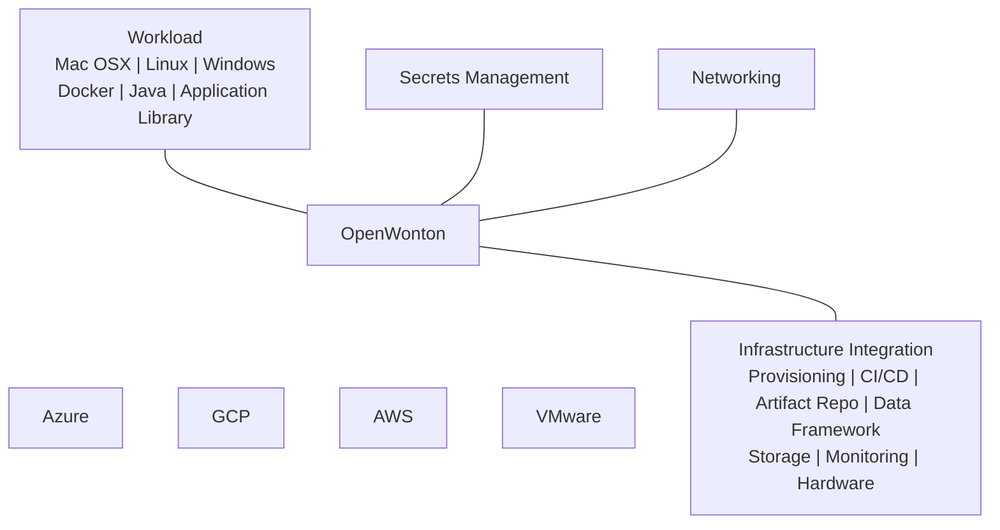
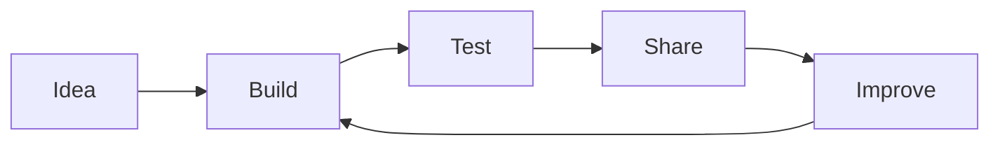

# OpenWonton Integrations

OpenWonton is a community fork and integrations are community-driven. There is no
formal certification or partner program; instead, we aim for clear docs, helpful
examples, and a straightforward contribution path.

## Where integrations fit

OpenWonton can integrate with many parts of your stack:

Mermaid diagram:

## Common integration types

- Task drivers and runtime plugins: [/nomad/docs/drivers](/nomad/docs/drivers)
- Task driver plugins guide: [/nomad/docs/concepts/plugins/task-drivers](/nomad/docs/concepts/plugins/task-drivers)
- Device plugins: [/nomad/docs/concepts/plugins/devices](/nomad/docs/concepts/plugins/devices)
- CSI plugins: [/nomad/docs/concepts/plugins/csi](/nomad/docs/concepts/plugins/csi)
- Autoscaling plugins: [/nomad/tools/autoscaling](/nomad/tools/autoscaling)
- Telemetry/monitoring: [/nomad/docs/operations/monitoring-nomad](/nomad/docs/operations/monitoring-nomad)

## Lightweight contribution path

Mermaid diagram:

1. Start a discussion or open an issue with your integration idea:
   https://github.com/openwonton/openwonton/issues
2. Build a proof of concept and follow the plugin docs linked above.
3. Add tests and documentation so others can try it.
4. Submit a PR. Reviews are best-effort and community-driven.

## Expectations and support

- Integrations are typically maintained by their authors.
- There are no SLAs; support is community best-effort.
- We prioritize compatibility and clear documentation so users can self-serve.

## Contact

For questions or feedback, open an issue:
https://github.com/openwonton/openwonton/issues
