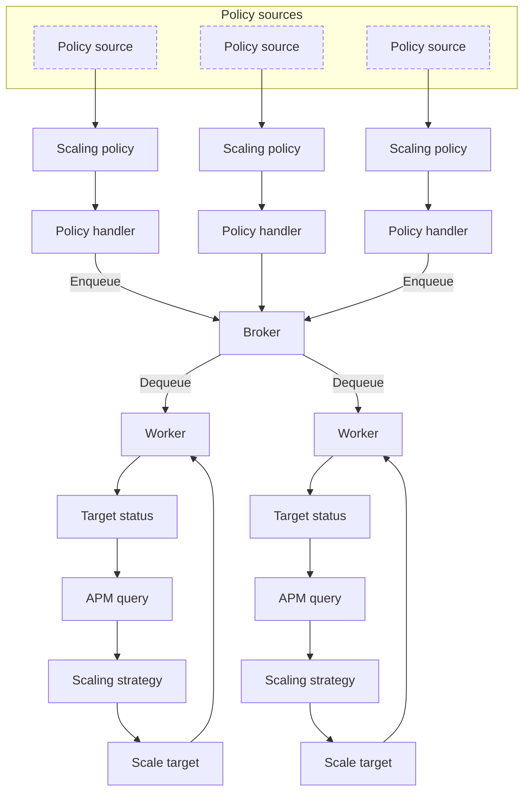

# Policy Evaluation

When the Nomad Autoscaler [agent] starts it loads all the policies defined in
the [sources][agent_source] configured and monitors them for changes. Each
policy is assigned a handler that periodically sends the policy to a broker
where it is evaluated by a worker. The frequency the policy is enqueued is set
by its [`evaluation_interval`][policy_eval_interval].

The worker executes a series of steps by calling the different plugins used in
the policy to determine if a scaling action is needed and then to apply the
necessary actions. The worker then loops back to evaluate the next policy.

If a scaling action is performed and the policy defines a
[`cooldown`][policy_cooldown] value the policy handler waits the specified
value before enqueuing it again.

If the policy target are Nomad clients the target plugin will usually execute
more steps, such as [selecting nodes to be removed][concepts_node_selector] and
draining them.

Mermaid diagram:

[agent]: /nomad/tools/autoscaling/agent
[agent_source]: /nomad/tools/autoscaling/agent/policy#source-parameters
[concepts_node_selector]: /nomad/tools/autoscaling/concepts/policy-eval/node-selector-strategy
[policy_cooldown]: /nomad/tools/autoscaling/policy#cooldown
[policy_eval_interval]: /nomad/tools/autoscaling/policy#evaluation_interval
